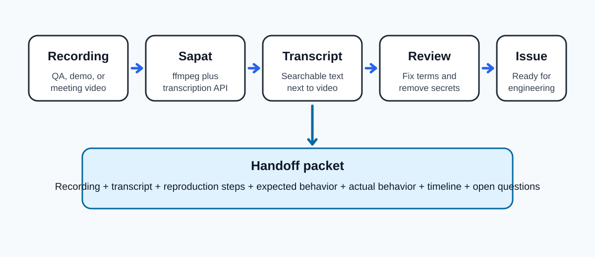

# Turn Recordings Into Developer Handoffs

QA recordings are useful, but they are rarely ready for engineering work. A five minute screen recording may contain the bug, the workaround, the user impact, the browser state, and the expected result. It may also contain long pauses, repeated sentences, side conversations, and missing context.

That creates a handoff problem. Engineers need a precise artifact: reproduction steps, expected behavior, actual behavior, environment notes, timestamps, and follow-up questions. A video alone is expensive to scan. A raw transcript alone is easier to search, but still not issue-ready.

This guide shows how to use [Sapat](https://github.com/nkkko/sapat) inside a [Daytona workspace](https://www.daytona.io/) to turn QA, demo, and meeting recordings into a [transcription handoff packet](/definitions/20260511_definition_transcription_handoff_packet.md).

Sapat converts video files to MP3 with `ffmpeg`, sends the audio to OpenAI, Groq, or Azure OpenAI for transcription, and writes a `.txt` transcript next to each input video.

The workflow below is intentionally practical. You will set up a repeatable workspace, process one recording or a directory of `.mp4` files, review the transcript, and convert it into an issue-ready developer handoff.



## TL;DR

- Use `daytona create https://github.com/nkkko/sapat --code` to open Sapat in a clean workspace.
- Configure one transcription provider in `.env`: OpenAI, Groq, or Azure OpenAI.
- Run `sapat path/to/video.mp4 --api groq --quality M --language en` for one video.
- Run `sapat path/to/recordings --api openai --quality M --language en` for a directory of `.mp4` files.
- Review the generated `.txt` files and turn them into a handoff packet with reproduction steps, observed behavior, expected behavior, timestamps, and unresolved questions.

## What Sapat Does in This Workflow

Sapat is a small Python transcription tool. The current project supports three providers:

| Provider | CLI value | Main environment variables |
| --- | --- | --- |
| OpenAI | `--api openai` | `OPENAI_API_KEY`, `OPENAI_MODEL`, `OPENAI_API_ENDPOINT`, `OPENAI_MODEL_NAME_CHAT` |
| Groq Cloud | `--api groq` | `GROQCLOUD_API_KEY`, `GROQCLOUD_MODEL`, `GROQCLOUD_API_ENDPOINT`, `GROQCLOUD_MODEL_NAME_CHAT` |
| Azure OpenAI | `--api azure` | `AZURE_OPENAI_API_KEY`, `AZURE_OPENAI_ENDPOINT`, `AZURE_OPENAI_DEPLOYMENT_NAME_WHISPER`, `AZURE_OPENAI_API_VERSION_WHISPER` |

The CLI accepts either a single file or a directory:

```bash
sapat demo-recording.mp4 --api groq
sapat ./recordings --api openai
```

When you pass a file, Sapat processes that file. When you pass a directory, it processes every `.mp4` file in that directory. For each input, it:

1. Converts the video to an MP3 file with `ffmpeg`.
2. Sends the MP3 to the selected transcription provider.
3. Writes a transcript to a `.txt` file with the same base name.
4. Deletes the temporary MP3 file.

The important part is that the transcript stays next to the recording. That makes it easy to store a packet like this in one folder:

```text
bug-1427/
  checkout-error.mp4
  checkout-error.txt
  handoff.md
```

## Prerequisites

You need four things:

- A Daytona installation and a working Daytona server.
- Python 3.6 or newer.
- `ffmpeg` available in the workspace.
- API credentials for OpenAI, Groq, or Azure OpenAI.

Sapat reads provider credentials from a `.env` file in the project root. The repository already includes `.env.example`, which is the safest starting point because it lists the exact variable names expected by the code.

> **Note:** Keep real API keys out of Git. Put them in `.env`, Daytona environment configuration, or your secret manager. Do not paste keys into the article, a transcript, a GitHub issue, or a video description.

## Create the Daytona Workspace

Start by creating a workspace from the Sapat repository:

```bash
daytona create https://github.com/nkkko/sapat --code
```

Daytona clones the repository and opens it in a clean development environment. That matters for transcription work because the setup tends to involve native tools such as `ffmpeg`, Python packages, and API credentials.

Keeping the workflow inside a workspace makes it easier to reproduce the same steps later or share them with another engineer.

Inside the workspace, install the project dependencies:

```bash
pip install -r requirements.txt
pip install -e .
```

The editable install exposes the `sapat` command from the project script entry:

```toml
[project.scripts]
sapat = "sapat.script:main"
```

Check that the CLI is visible:

```bash
sapat --help
```

You should see options for `--language`, `--prompt`, `--temperature`, `--quality`, `--correct`, and the required `--api` provider selection.

## Configure a Provider

Copy the example environment file:

```bash
cp .env.example .env
```

Then fill in one provider section. You do not need all three providers to run a basic workflow.

For Groq Cloud:

```env
GROQCLOUD_API_KEY=your_groq_key
GROQCLOUD_MODEL=whisper-large-v3-turbo
GROQCLOUD_API_ENDPOINT=https://api.groq.com/openai/v1/audio/transcriptions
GROQCLOUD_MODEL_NAME_CHAT=llama3-8b-8192
```

For OpenAI:

```env
OPENAI_API_KEY=your_openai_key
OPENAI_MODEL=whisper-1
OPENAI_API_ENDPOINT=https://api.openai.com/v1/audio/transcriptions
OPENAI_MODEL_NAME_CHAT=gpt-4o
```

For Azure OpenAI:

```env
AZURE_OPENAI_API_KEY=your_azure_key
AZURE_OPENAI_ENDPOINT=https://DEPLOYMENTENDPOINTNAME.openai.azure.com
AZURE_OPENAI_DEPLOYMENT_NAME_WHISPER=whisper
AZURE_OPENAI_API_VERSION_WHISPER=2024-06-01
AZURE_OPENAI_DEPLOYMENT_NAME_CHAT=gpt-4o
AZURE_OPENAI_API_VERSION_CHAT=2023-03-15-preview
```

Sapat uses `python-dotenv` to load `.env`, so the variable names must match the names above.

## Transcribe One Bug Recording

Create a folder for the incoming evidence:

```bash
mkdir -p recordings/checkout-bug
```

Put the recording in that folder:

```text
recordings/checkout-bug/checkout-error.mp4
```

Now run Sapat:

```bash
sapat recordings/checkout-bug/checkout-error.mp4 \
  --api groq \
  --quality M \
  --language en \
  --prompt "Checkout flow, payment form, cart total, browser console, HTTP 500" \
  --temperature 0.3
```

Here is what each flag is doing:

- `--api groq` selects the provider implementation.
- `--quality M` converts the video to a mono MP3 at 44.1 kHz and 96 kbps.
- `--language en` tells the transcription provider the expected language.
- `--prompt` gives the model vocabulary that may appear in the recording.
- `--temperature 0.3` keeps the transcription behavior conservative.

After the command finishes, Sapat writes:

```text
recordings/checkout-bug/checkout-error.txt
```

Do not treat this transcript as final. Treat it as evidence that needs review.

## Process a Directory of Recordings

If a QA engineer sends several videos from the same investigation, keep them together:

```text
recordings/search-regression/
  01-filter-empty-state.mp4
  02-filter-refresh.mp4
  03-filter-mobile.mp4
```

Run Sapat on the directory:

```bash
sapat recordings/search-regression \
  --api openai \
  --quality M \
  --language en \
  --prompt "Search filters, empty state, refresh, mobile viewport, regression"
```

Sapat processes every `.mp4` file in the directory and creates one transcript per recording:

```text
recordings/search-regression/
  01-filter-empty-state.txt
  02-filter-refresh.txt
  03-filter-mobile.txt
```

This is the point where the workflow becomes more than transcription. You now have searchable text for every recording, but you still need to turn it into engineering material.

## Turn the Transcript Into a Handoff Packet

Create a `handoff.md` file next to the recording and transcript:

```bash
touch recordings/checkout-bug/handoff.md
```

Use this structure:

```markdown
# Checkout Error Handoff

## Source files

- Recording: `checkout-error.mp4`
- Transcript: `checkout-error.txt`

## Summary

One sentence describing the failure and user impact.

## Environment

- Browser:
- OS:
- User role:
- Workspace/project:
- Date observed:

## Reproduction steps

1. Open ...
2. Click ...
3. Submit ...

## Expected behavior

What should have happened.

## Actual behavior

What happened instead.

## Evidence timeline

| Timestamp | Observation | Engineering note |
| --- | --- | --- |
| 00:12 | User opens checkout | Starting state |
| 00:38 | Payment form submits | Watch network request |
| 00:41 | Error appears | Capture error text |

## Open questions

- Does this only happen for one account?
- Does the same request fail in staging?
```

The point is not to copy the transcript into the issue. The point is to extract the parts that help an engineer act.

## Use `--correct`, but Still Review the Output

Sapat includes a `--correct` flag. In the current source, the OpenAI and Groq implementations run a second pass over the transcript using a chat model.

For Azure OpenAI, review the current implementation before relying on correction in an automated workflow. The transcription path is present, but correction behavior should be verified against your deployment before you make it part of a handoff runbook.

Example:

```bash
sapat recordings/checkout-bug/checkout-error.mp4 \
  --api openai \
  --quality H \
  --language en \
  --prompt "Daytona, workspace, checkout, webhook, Stripe" \
  --correct
```

For OpenAI or Groq, this is useful when product names, command names, or domain terms are repeatedly misheard. It is not a replacement for human review. The correction pass may improve punctuation and spelling.

The owner of the handoff still needs to check timestamps, commands, URLs, error messages, and claims about expected behavior.

Use the corrected transcript as a draft. Use the recording as the source of truth.

## Choose Quality Based on the Recording

Sapat exposes three MP3 conversion quality levels:

| Flag | Conversion shape | Good for |
| --- | --- | --- |
| `--quality L` | 22.05 kHz, mono, 96 kbps | Clear speech, small files, quick experiments |
| `--quality M` | 44.1 kHz, mono, 96 kbps | Default QA and meeting recordings |
| `--quality H` | 44.1 kHz, stereo, 192 kbps | Noisy calls, overlapping speakers, important demos |

Start with `M`. Use `H` when the recording has background noise, two speakers, or a screen-share narration that includes code and product terms.

## Add a Transcript Review Checklist

A transcript that reads well can still be misleading. Add a review checklist before opening the engineering issue:

- **Commands:** Are CLI commands spelled exactly as shown on screen?
- **URLs:** Are routes, query strings, and domains copied correctly?
- **Errors:** Are stack traces, HTTP status codes, and toast messages exact?
- **Accounts:** Are user roles and permissions clear?
- **Timing:** Does the timeline identify when the failure starts?
- **Privacy:** Did you remove customer names, tokens, emails, and internal secrets?
- **Expected behavior:** Is it stated by the product owner, tester, or docs?

This checklist prevents a common failure mode: a transcript is polished, but the bug report is still ambiguous.

## Troubleshooting

If Sapat fails before transcription starts, check `ffmpeg` first:

```bash
ffmpeg -version
```

If `ffmpeg` is not found, install it in the workspace image or add it to the PATH used by your terminal.

If transcription fails with provider errors, check:

- The selected `--api` value matches the configured provider.
- The `.env` file exists in the Sapat project root.
- The endpoint URL is correct.
- The provider account has credits and access to the selected model.
- The generated MP3 is below the provider's upload size limit.

If the output transcript is too generic, rerun with a better `--prompt`. Include product names, feature names, route names, and domain words that appear in the recording.

If a directory run skips files, confirm the files end in `.mp4`. The current CLI walks `.mp4` files in the given directory.

## Conclusion

Sapat gives AI engineers a straightforward way to create transcripts from real recordings. Daytona makes that workflow easier to repeat because the repository, dependencies, provider configuration, and handoff files all live in a clean workspace.

The useful artifact is not just `checkout-error.txt`. The useful artifact is the handoff packet: transcript, recording, reproduction steps, timeline, expected behavior, actual behavior, and open questions. That packet turns a recording from "watch this video" into something an engineer can debug.

Start with one recording. Transcribe it. Review it. Extract the handoff. Then use the same Daytona workspace for every QA video that follows.

## References

- [Sapat repository](https://github.com/nkkko/sapat)
- [Daytona repository](https://github.com/daytonaio/daytona)
- [Daytona environment variables guide](20241126_Using_Environmental_Variables_in_Daytona.md)
- [OpenAI audio transcription API](https://platform.openai.com/docs/guides/speech-to-text)
- [Groq speech-to-text documentation](https://console.groq.com/docs/speech-to-text)
- [Azure OpenAI audio transcription documentation](https://learn.microsoft.com/azure/ai-services/openai/audio-completions-quickstart)
